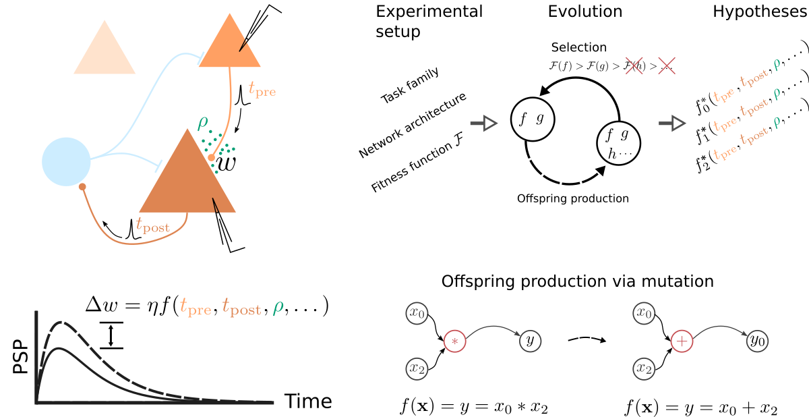

# e2l-cgp-snn
## Evolving to learn: discovering interpretable plasticity rules for spiking networks

This repository contains data and analysis scripts to reproduce the figures as well as source code and simulation scripts to perform the experiments described in [1].

<div style="text-align:center"></div>

<sub>__Artificial evolution of synaptic plasticity rules in spiking neuronal networks__. Figure from Jordan, Schmidt, Senn & Petrovici, "Evolving to learn: discovering interpretable plasticity rules for spiking networks", [ arxiv:2005.14149](https://arxiv.org/abs/2005.14149).</sub>

This repository is organized as follows:

- `figures` contains scripts to reproduce all figures
- `data` contains data to reproduce all figures
- `experiments` contains scripts to perform the described experiments
- `nest` contains custom synapse models and kernel patches for NEST (required to run the experiments)

# Docker container

The easiest way to reproduce the figures and experiments is to use the Dockerfile in this repository. It a Python interpreter with all dependencies installed and a built NEST with all synapse modules compiled. To use it, do the following:

- Build the Docker container (`docker build .`) and run the container in interactive mode.
- Reproduce the figures:

  ```bash
  cd e2l-cgp-snn/figures
  make all  
  ```
- Test the NEST synapse modules:
  Start a Python console and execute:
  ```python
  import nest

  
  nest.Install('usrl_synapse_module')
  nest.Install('HomeostaticSTDPmodule')
  nest.Install('stdp_sympy_synapse_module') 
  nest.Install('us_sympy_synapse_module') 
  ```

# Prepare your Python environment

Our scripts rely on a few Python packages that you might need to install. These are specified in `requirements.txt`. You can conveniently install them via pip:
```bash
pip install -r requirements.txt
```

# Reproduce figures

To reproduce figures we provide a Makefile. Reproducing all figures is as easy as
```bash
cd figures
make all
```

You can reproduce a specific figure, e.g., figure 3 with
```bash
make fig3
```

Note that you need to install the [stdp-sympy-synapse-module](https://github.com/Happy-Algorithms-League/e2l-cgp-snn/tree/65d6b28b5129164cab11be4bb5ab9c078fd764c2/nest/stdp-sympy-synapse-module) and [stdp-homeostatic-synapse-module](https://github.com/Happy-Algorithms-League/e2l-cgp-snn/tree/65d6b28b5129164cab11be4bb5ab9c078fd764c2/nest/stdp-homeostatic-synapse-module) synapse modules for NEST to reproduce figure 5 (see [below](https://github.com/Happy-Algorithms-League/e2l-cgp-snn#prepare-your-nest-installation) for instructions).

# Run experiments yourself

You can run the described experiments for each learning scenario (reward-driven, error-driven, and correlation-driven) yourself. We provide detailed instructions in the README in each `experiments` subfolder.

While in principle the experiments can be performed on a laptop, we would highly recommend using a workstation or cluster to reduce wall clock time by exploiting parallelization. Natively, the scripts support [Slurm](https://slurm.schedmd.com/), but can be adapted to other environments.

## Prepare your NEST installation

To be able to perform the experiments yourself you need to first prepare your NEST [2, [www.nest-simulator.org](https://www.nest-simulator.org/)] installation. The simulations rely on a slightly modified NEST version and custom synapse modules. Please follow the steps below to make sure you can execute the simulations in `experiments` successfully.

1. Build [symengine](https://github.com/symengine/symengine) from source following their [installation instructions](https://github.com/symengine/symengine#building-from-source).

2. Grab NEST from their [git repository](https://github.com/nest/nest-simulator) and checkout the correct version:
   ```bash
   git clone git@github.com:nest/nest-simulator.git
   cd nest-simulator
   git checkout 27dc242
   ```
   In case you are wondering: there is nothing special about this NEST version, it just happened to be one of the most-up-to-date version while preparing this repository.
   
3. Apply the provided NEST kernel patch to add support for time-driven spiking events. Make sure you execute the following command from within the NEST git repository:
   ```bash
   git apply path/to/this/repository/nest/ltl_usrl_us_sympy.patch
   ```
   The error- and reward-driven models rely on continuously propagating synaptic state variables, and this patch adds time-driven update of spiking connections to NEST.
   
4. Build NEST from the modified source following their [installation instructions](https://nest-simulator.readthedocs.io/en/stable/installation/index.html#advanced-install).

5. Build and install the custom synapse modules. For concreteness we here consider the error-driven synapse.
   ```bash
   cd  path/to/this/repository/nest/us-sympy-synapse-module/
   mkdir build
   cd build
   cmake -Dwith-nest=path/to/nest/installation/install/bin/nest-config -Dwith-symengine=path/to/symengine/installation/install/ ../
   make
   make install
   ```
   These steps are almost identical for the other synapse modules: for `stdp-homeostatic-synapse-module` and `usrl-synapse-module` you should drop the `-Dwith-symengine` argument as they do not require symengine.
   
6. Make sure NEST finds the custom synapse modules. Before, you need to tell your Python interpreter where to find NEST, and NEST where it can find the required shared libraries (symengine and synapse modules).
   ```bash
   export PYTHONPATH=path/to/nest/installation/lib/python3.7/site-packages/:$PYTHONPATH
   export LD_LIBRARY_PATH=path/to/symengine/installation/lib/:$LD_LIBRARY_PATH
   export LD_LIBRARY_PATH=path/to/nest/installation/lib/:$LD_LIBRARY_PATH
   python
   ```
   ```python
   >>> import nest
   [...]
   >>> nest.Install('us_sympy_synapse_module')
   Jun 09 14:52:19 Install [Info]: 
	   loaded module USSymPy Synapse Module
   >>>
   ```
   If your output looks like above, you are prepared to run the experiments yourself and alter them to your liking. Happy hacking!

## References
[1] Jordan, J.\*, Schmidt, M.\*, Senn, W., & Petrovici, M. A. (2020). Evolving to learn: discovering interpretable plasticity rules for spiking networks. arXiv preprint arXiv:2005.14149. *These authors contributed equally to this work.

[2] Gewaltig, M. O., & Diesmann, M. (2007). NEST (NEural Simulation Tool). Scholarpedia, 2(4), 1430.
