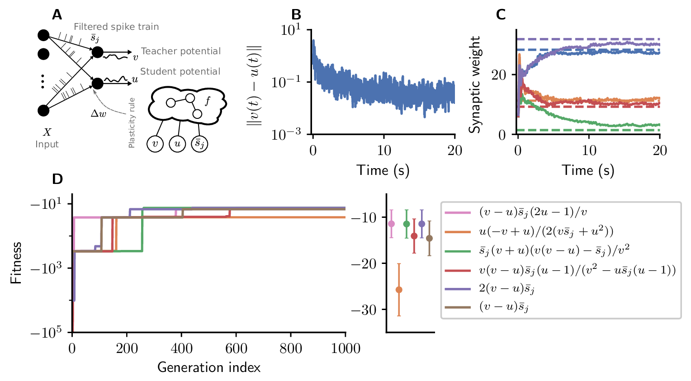

# Error-driven learning experiments

This folder contains simulation scripts to perform error-driven learning experiments.

<div style="text-align:center"></div>

## Prerequisites

To be able to run an an experiment, install the required [Python dependencies](https://github.com/Happy-Algorithms-League/e2l-cgp-snn#prepare-your-python-environment), follow the [instructions for preparing your NEST installation](https://github.com/Happy-Algorithms-League/e2l-cgp-snn#prepare-your-nest-installation). This experiment requires the `us-sympy-synapse-module` synapse modules.

## Running an experiment

To prepare an experiment, execute `python write_job.py`. This script will create a folder labeled with a unique hash generated from the simulation scripts and the specified parameters. This folder contains all required code and parameterfiles to run a specific experiment. Navigate into the folder and execute `main.py` with an integer argument that is used to seed random number generators:

```shell script
python write_job.py
cd <jobfolder>
python main.py <int>
```

If you have a workstation or cluster available which uses SLURM, add your details to the jobfile template and fill in your specific parameters in the `machine_params` dictionary in `write_job.py` prior to executing it.

## Reproducing the data of Figure 4

To reproduce the fitness values over generation index (Fig4D), the entire evolution has to be run. Since this evolution was run on a specific HPC system, the exact numerical values cannot reproduced easily. The other data (error-/weight traces and validation results) can be reproduced with the `create_traces.py` and `run_validation_sim.py` scripts.

```shell script
python create_traces.py ../../data/error-driven/91f21d6d01014991285e5264a59aa967/
python run_validation_sim.py ../../data/error-driven/91f21d6d01014991285e5264a59aa967/
```

You can also create this data for other experiments that you have run by replacing the data directory argument with the appropriate path to your experiment folder.
